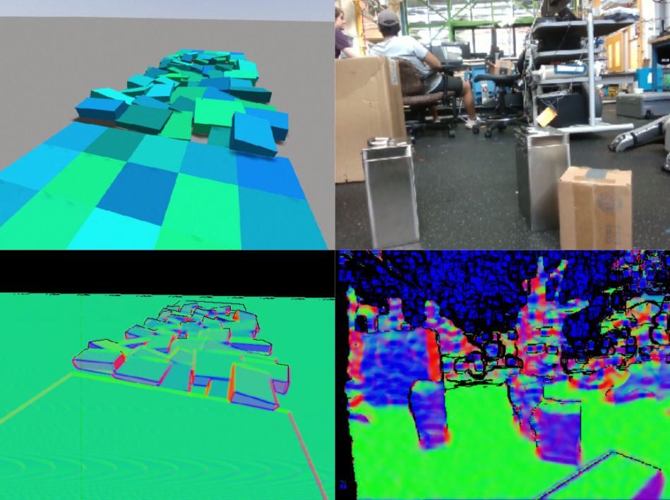

# Depth Image Gradients-based Surface Normal Estimation

<p>
     
</p>


## Introduction
This is a C++/ROS2 implementation of a depth image gradients-based surface normal estimation algorithm. We implemented the ["Estimating Surface Normals with Depth Image Gradients for Fast and Accurate Registration"](https://ieeexplore.ieee.org/document/7335535) algorithm inside of a ROS2 node.

## Dependencies

### ROS Dependencies
This package has been tested on Ubuntu 22.04 / ROS2 Humble. 

1. Install [ROS2 Humble](https://docs.ros.org/en/humble/index.html).

2. Install the following ROS2 Humble packages:
    ```sh
    sudo apt-get install ros-humble-perception ros-humble-perception-pcl
    ```

## Building

Now you can build the `depth_img_normal_estimation` package. 

```
MAKEFLAGS="-j 4" colcon build --symlink-install --executor sequential --mixin rel-with-deb-info --packages-up-to depth_img_normal_estimation
```

The parameter `MAKEFLAGS="-j 4"` limits the number (4) of cores used during build, and `--executor sequential` makes sure packages are built sequentially, not in parallel. The parameter `--mixin rel-with-deb-info` builds the release version of the code for better performance, though this needs colcon mixin to be set up. Feel free to adjust these to your liking. I would also recommend that you export this alias into your bashrc so that you do not have to copy this in every time:

```
echo "alias buildros2='cd ~/ros2_ws && MAKEFLAGS="-j 4" colcon build --symlink-install --executor sequential --mixin rel-with-deb-info --packages-up-to'" >> ~/.bashrc  
```

## Running

Now, you can run the depth image surface normal estimation with

```
ros2 launch depth_img_normal_estimation normal_estimation_sim.launch.py
```

Depth images are expected to come in on the `/camera/depth/image_raw` topic, and tunable parameters for image pre-processing can be found in the `cfg` folder.