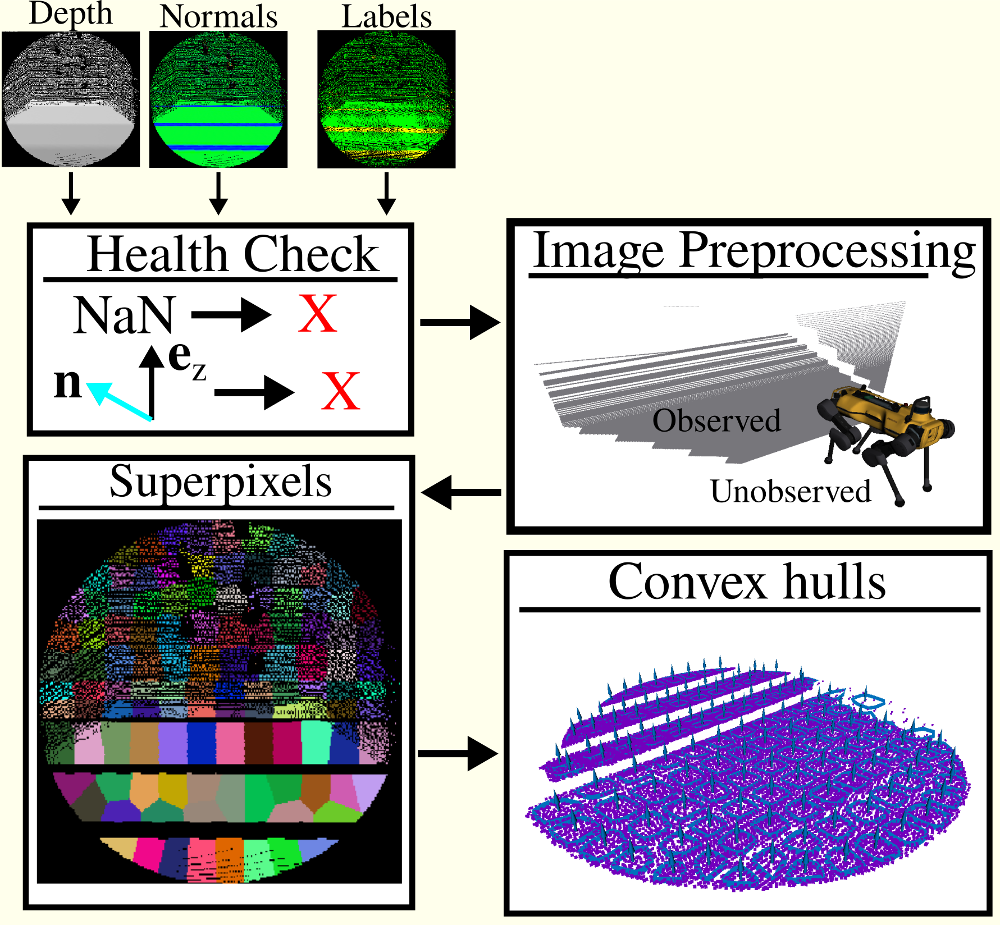

# Superpixels Oversegmentation

<p>
     
</p>

## Introduction
This is a C++/ROS2 implementation of superpixels-based oversegmentation. We adapted the [SLIC](https://ieeexplore.ieee.org/document/6205760) algorithm for sparse depth images.

## Dependencies

### ROS Dependencies
This package has been tested on Ubuntu 22.04 / ROS2 Humble. 

1. Install [ROS2 Humble](https://docs.ros.org/en/humble/index.html).

2. Install the following ROS2 Humble packages:
    ```sh
    sudo apt-get install ros-humble-perception ros-humble-perception-pcl
    ```

### OCS2 Dependencies

To run our perception pipeline, you need to compile the OCS2 toolbox. 

1. Follow the OCS2 installation instructions on the `ros2_humble` branch <a href="https://github.com/GTLIDAR/ocs2/tree/ros2_humble">here</a>.

### Perception Dependencies

1. Install the depth_img_normal_estimation ROS2 package on the `ros2_humble` branch <a href="https://github.com/max-assel/depth_img_normal_estimation/tree/ros2_humble">here</a>.

2. Install the egocylindrical ROS2 package on the `ros2_humble` branch <a href="https://github.com/ivaROS/egocylindrical/tree/ros2_humble">here</a>.

3. Install the egocylindrical_msgs ROS2 package on the `ros2_humble` branch <a href="https://github.com/ivaROS/egocylindrical_msgs/tree/ros2_humble">here</a>.

## Building

Now you can build the `superpixels` package. 

```
MAKEFLAGS="-j 4" colcon build --symlink-install --executor sequential --mixin rel-with-deb-info --packages-up-to superpixels
```

Building ocs2 can be quite computationally expensive, so `MAKEFLAGS="-j 4"` limits the number (4) of cores used during build, and `--executor sequential` makes sure packages are built sequentially, not in parallel. `--mixin rel-with-deb-info` builds the release version of the code, not the debugging version in order to get better performance, though this needs colcon mixin to be set up. Feel free to adjust these to your liking. I would also recommend that you export this alias into your bashrc so that you do not have to copy this in every time

```
echo "alias buildros2='cd ~/ros2_ws && MAKEFLAGS="-j 4" colcon build --symlink-install --executor sequential --mixin rel-with-deb-info --packages-up-to'" >> ~/.bashrc  
```

## Running

Now, you can run the superpixels pipeline with

```
ros2 launch superpixels superpixel_depth_segmentation_sim.launch.py
```